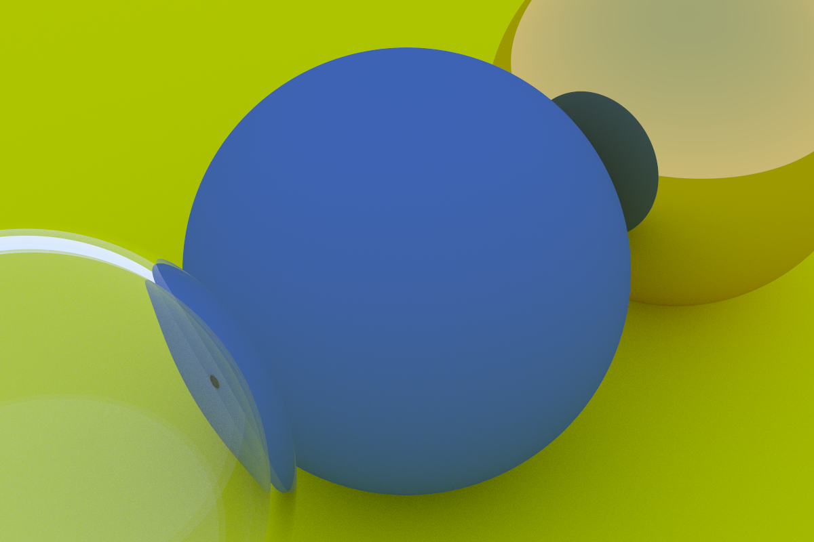

rust-raytracing
===============

My implementation of [_Ray Tracing in One Weekend_](https://raytracing.github.io/books/RayTracingInOneWeekend.html) and (part of) [_Ray Tracing: The Next Week_](https://raytracing.github.io/books/RayTracingTheNextWeek.html) in Rust.

## Progress

- [x] basic RTWeekend features
- [x] multithreading
- [x] argument parsing
- [x] BVH
- [x] motion blur
- [x] better multithreading (a queue of tiles instead of using fewer samples)
- [x] textures (solid, noise, images)
- [x] rectangles and lights
- [x] instances
- [x] volumes
- [x] final scene from _The Next Week_
- [x] color management
- [x] pride flag materials
- [x] PNG output?
- [ ] PORTALS
- [ ] mesh geometry?

## Usage

With Rust and Cargo installed, you can use `cargo run --release` to run with the default settings (including output to stdout), or `cargo run --release -- <ARGS>` to run with different arguments. Or after compiling it (one of the `run` commands or `cargo build --release`), you can run the executable in `./target/release` directly without using `cargo`.

```
usage: raytracing [-t|--threads n] [-w|--width w] [-s|--samples s] [-r|--seed r] 
         [-d|--depth d] [-o|--output filename] [-S|--scene scene]

  -t, --threads n:       number of threads. default: number of logical processors
  -w, --width w:         width of image in pixels. default: 600
  -s, --samples s:       number of samples per pixel. default: 100
  -d, --depth d:         maximum bounces per ray. default: 50
  -r, --seed r:          random number seed. default: entropy from the OS
  -o, --output filename: file to output PPM image to. default: stdout
  -v, --verbose:         log performance data to stderr
  -S, --scene scene:     which scene to render. options:
    weekend:
      random spheres; final render from Ray Tracing in One Weekend
    gay:
      the random spheres scene, but with pride flag textures on the small spheres
    tuesday:
      the random spheres scene, but upgraded with features from The Next Week:
        - moving spheres
        - checkered ground texture
    figure19:
      figure 19 from Ray Tracing in One Weekend; three spheres with different materials
    refraction:
      a series of spheres lowering into a refractive material
    default: weekend
```

## Samples

Each generated with `-w 1200 -s 500`, and then converted from PPM into lossless WebP.

### [Random spheres](https://raytracing.github.io/books/RayTracingInOneWeekend.html#wherenext?/afinalrender) (seed: `31368665636066006`)


### [Random moving spheres](https://raytracing.github.io/books/RayTracingTheNextWeek.html#motionblur/puttingeverythingtogether) (seed: `12883212685894696376`)


### [Figure 19](https://raytracing.github.io/books/RayTracingInOneWeekend.html#positionablecamera/positioningandorientingthecamera)



### Refraction demo


